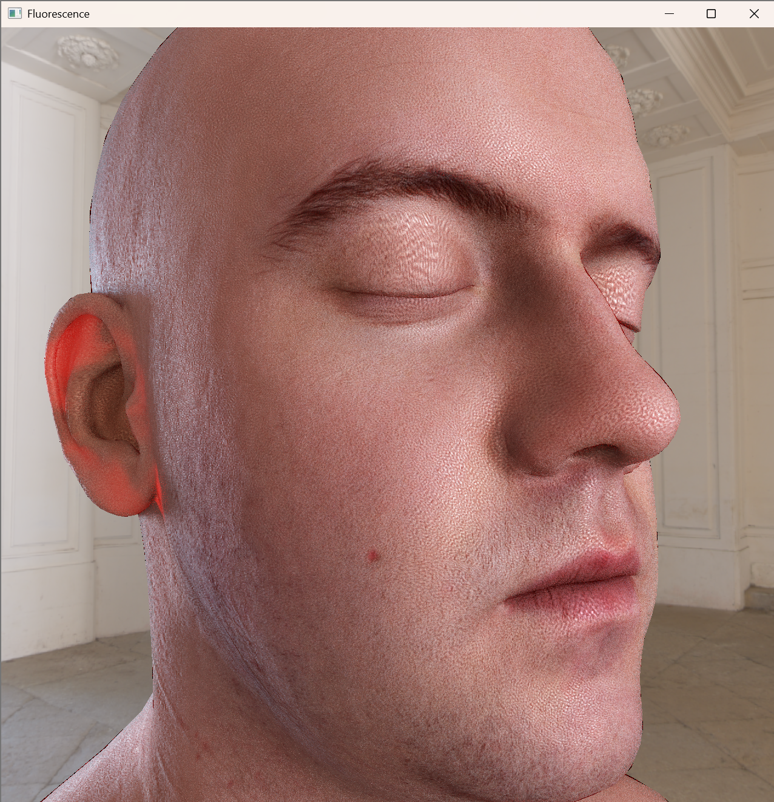
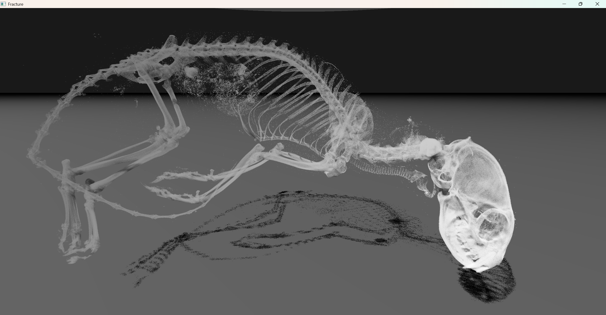
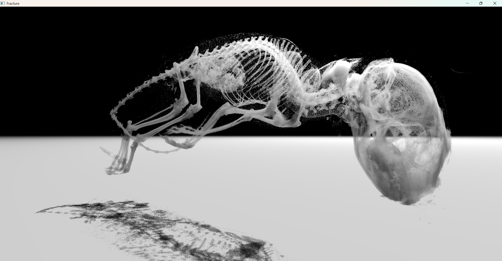

# Gallery



<!-- TODO Add section explaining how Fluorescence works... -->

----------------------------------------

# Projects and Experiments

## Skin Rendering Experiments
- Screen-space techniques to approximate subsurface scattering, shadows, and translucency
- Two-layered skin BRDF with adjustable diffusion profile
- Procedural generator for high-frequency spec map

## Fracture: CT Scan Renderer 
- CT Scan parsing and streaming
- Custom compact voxel format 
- Simple volumetric rendering, direct lighting with shadows

<iframe width="720" height="400" src="https://youtube.com/embed/OBpT-b9hnh8?playlist=OBpT-b9hnh8&autoplay=1&mute=1&loop=1" frameborder="0"> </iframe>

## Restir DI
- Simple implementation of spatial and temporal light resampling based on Restir DI

<iframe width="720" height="400" src="https://youtube.com/embed/g04pGKIIO2I?playlist=g04pGKIIO2I&autoplay=1&mute=1&loop=1" frameborder="0"> </iframe>

## Pies: Soft Body Solver
- Projective Dynamics solver implementation
- Spatial hash broadphase and cubic-rootfinding CCD narrowphase
- Experimental incremental potential contact (IPC) implementation
- Various constraint implementations - tetrahedral-strain, distance, bending, friction, and collisions
- Integration into Maya as an authoring tool plugin

<iframe width="720" height="400" src="https://youtube.com/embed/Z5iBf8emENg?playlist=Z5iBf8emENg&autoplay=1&mute=1&loop=1" frameborder="0" allow='autplay'> </iframe>
<iframe width="720" height="400" src="https://youtube.com/embed/N4j6QIjG2vE?playlist=N4j6QIjG2vE&autoplay=1&mute=1&loop=1" frameborder="0" allow="autplay"> </iframe>

## Fractal Fluids
- Grid-based 2D fluid simulation and fractal renderer
<!--  redundant with thumbnail, move to gallery-->
<iframe width="720" height="400" src="https://youtube.com/embed/_ygAZg0iPBQ?playlist=_ygAZg0iPBQ&autoplay=1&mute=1&loop=1" frameborder="0" allow="autplay"> </iframe>

<iframe src="https://youtube.com/embed/ELGxPJAH8Ac?playlist=ELGxPJAH8Ac&autoplay=1&mute=1&loop=1" frameborder="0" allow="autplay"> </iframe>

<iframe src="https://youtube.com/embed/VFFfwDNePlc?playlist=VFFfwDNePlc&autoplay=1&mute=1&loop=1" frameborder="0" allow="autplay"> </iframe> 

## Smoke Simulation and Rendering

- Grid-based fluid simulation and volumetric rendering

<!--  redundant with thumbnail, move to gallery-->
<!--  redundant with thumbnail, move to gallery-->
<iframe width="720" height="400" src="https://youtube.com/embed/HKq5Odd_AWo?playlist=HKq5Odd_AWo&autoplay=1&mute=1&loop=1" frameborder="0" allow="autplay"> </iframe>

## GPU Collision Detection with One Million Particles

- Fast GPU spatial hashing implementation for collision detection 
- Parallelized Jacobi iterations to resolve collisions

<iframe width="720" height="400" src="https://youtube.com/embed/3F8sH3cQDxk?playlist=3F8sH3cQDxk&autoplay=1&mute=1&loop=1" frameborder="0" allow="autplay"> </iframe>

## Cloth Self-Collision
- KD Tree broadphase implementation
- Conjugate gradient descent solver - distance and collision constraints

<iframe width="720" height="400" src="https://youtube.com/embed/pMOo3RrO-Po?playlist=pMOo3RrO-Po&autoplay=1&mute=1&loop=1" frameborder="0" allow="autplay"> </iframe>
<iframe width="720" height="400" src="https://youtube.com/embed/j2Rxeo_FoZ0?playlist=j2Rxeo_FoZ0&autoplay=1&mute=1&loop=1" frameborder="0" allow="autplay"> </iframe>